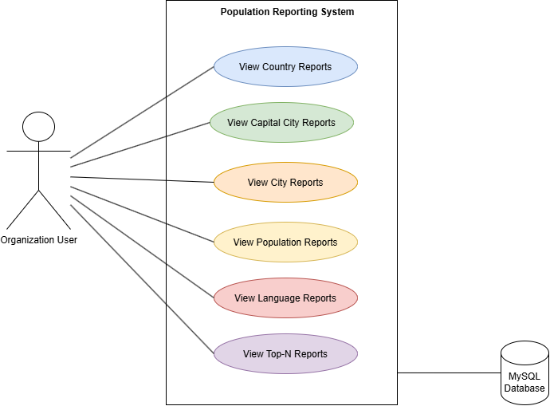

## Use Case Diagram

[Open the editable Use Case Diagram](Population_Reporting_System_Use_Case.drawio)

## Use Case Diagram Summary

The Use Case Diagram shows the main functions of the Population Reporting System and how the user interacts with the system. It contains 32 use cases grouped into country reports, city reports, capital city reports, population distribution reports, additional population reports, and language reports.

The system allows the user to view population information for the world, continents, regions, countries, districts, and cities. It also provides reports of the most populated countries, cities, and capital cities.

The Population Distribution Reports show total population, the population living in cities, and the population not living in cities, including percentages. The Language Report shows the number of speakers of Chinese, English, Hindi, Spanish, and Arabic, together with their percentages of the world population.

Overall, the diagram provides an overview of the system's reporting functions and supports the detailed use case descriptions in this document.

# Full Use Case Descriptions

## 1. Introduction

This document describes the 32 use cases for the Population Reporting System. The system retrieves data from an SQL database and generates reports about countries, cities, capital cities, population figures, and language speakers.

**Primary Actor:** Organisation User

## 2. Use Case Description Format

Each use case contains the following sections:

- **Actor:** The person who uses the system.
- **Goal:** The result the actor wants to achieve.
- **Preconditions:** Conditions that must be met before the use case starts.
- **Trigger:** The action that starts the use case.
- **Main Success Flow:** The normal steps followed to complete the use case.
- **Alternative / Exception Flow:** Steps followed when data is missing, input is invalid, or an error occurs.
- **Postconditions:** The result after the use case finishes.

---

## 3. Country Reports

### UC01 – All Countries in the World

**Actor:** Organisation User

**Goal:** Display all countries in the world, ordered by population from largest to smallest.

**Preconditions:** The database is available and contains country data.

**Trigger:** The user selects the All Countries report.

**Main Success Flow:**
1. The user requests the report.
2. The system retrieves all country records from the database.
3. The system sorts countries by population in descending order.
4. The system displays Code, Name, Continent, Region, Population, and Capital.

**Alternative / Exception Flow:**
- If no country records are available, the system displays an appropriate message.
- If a database error occurs, the system displays an error message.

**Postconditions:** The report of all countries is displayed in the required order.

### UC02 – Countries by Continent

**Actor:** Organisation User

**Goal:** Display countries in a selected continent, ordered by population from largest to smallest.

**Preconditions:** Country and continent data are available.

**Trigger:** The user selects the Countries by Continent report.

**Main Success Flow:**
1. The user requests the report.
2. The system asks the user to select a continent.
3. The user selects a continent.
4. The system retrieves countries belonging to the selected continent.
5. The system sorts the countries by population in descending order.
6. The system displays the required country information.

**Alternative / Exception Flow:**
- If no countries match the selected continent, the system displays a message.
- If a database error occurs, the system displays an error message.

**Postconditions:** The countries in the selected continent are displayed in the required order.

### UC03 – Countries by Region

**Actor:** Organisation User

**Goal:** Display countries in a selected region, ordered by population from largest to smallest.

**Preconditions:** Country and region data are available.

**Trigger:** The user selects the Countries by Region report.

**Main Success Flow:**
1. The user requests the report.
2. The system asks the user to select a region.
3. The user selects a region.
4. The system retrieves countries belonging to the selected region.
5. The system sorts the countries by population in descending order.
6. The system displays the required country information.

**Alternative / Exception Flow:**
- If no countries match the selected region, the system displays a message.
- If a database error occurs, the system displays an error message.

**Postconditions:** The countries in the selected region are displayed in the required order.

### UC04 – Top N Populated Countries in the World

**Actor:** Organisation User

**Goal:** Display the top N countries with the largest populations worldwide.

**Preconditions:** Country population data are available.

**Trigger:** The user selects the Top N Countries in the World report.

**Main Success Flow:**
1. The user requests the report.
2. The system asks the user to enter N.
3. The user enters a positive integer.
4. The system sorts all countries by population in descending order.
5. The system selects the first N countries.
6. The system displays the selected countries and their required information.

**Alternative / Exception Flow:**
- If N is not a positive integer, the system asks the user to enter a valid value.
- If fewer than N countries are available, the system displays the available countries.

**Postconditions:** The top N most populated countries are displayed.

### UC05 – Top N Populated Countries in a Continent

**Actor:** Organisation User

**Goal:** Display the top N countries by population in a selected continent.

**Preconditions:** Country, continent, and population data are available.

**Trigger:** The user selects the Top N Countries by Continent report.

**Main Success Flow:**
1. The user requests the report.
2. The system asks the user to select a continent and enter N.
3. The user provides the required values.
4. The system retrieves countries in the selected continent.
5. The system sorts them by population in descending order.
6. The system displays the first N countries.

**Alternative / Exception Flow:**
- If N is invalid, the system asks the user to enter a positive integer.
- If no countries match the selected continent, the system displays a message.

**Postconditions:** The top N most populated countries in the selected continent are displayed.

### UC06 – Top N Populated Countries in a Region

**Actor:** Organisation User

**Goal:** Display the top N countries by population in a selected region.

**Preconditions:** Country, region, and population data are available.

**Trigger:** The user selects the Top N Countries by Region report.

**Main Success Flow:**
1. The user requests the report.
2. The system asks the user to select a region and enter N.
3. The user provides the required values.
4. The system retrieves countries in the selected region.
5. The system sorts them by population in descending order.
6. The system displays the first N countries.

**Alternative / Exception Flow:**
- If N is invalid, the system asks the user to enter a positive integer.
- If no countries match the selected region, the system displays a message.

**Postconditions:** The top N most populated countries in the selected region are displayed.

---

## 4. City Reports

### UC07 – All Cities in the World

**Actor:** Organisation User

**Goal:** Display all cities worldwide, ordered by population from largest to smallest.

**Preconditions:** City, country, and population data are available.

**Trigger:** The user selects the All Cities report.

**Main Success Flow:**
1. The user requests the report.
2. The system retrieves all city records from the database.
3. The system sorts cities by population in descending order.
4. The system displays Name, Country, District, and Population.

**Alternative / Exception Flow:**
- If no city records are available, the system displays a message.
- If a database error occurs, the system displays an error message.

**Postconditions:** All cities are displayed in the required order.

### UC08 – Cities by Continent

**Actor:** Organisation User

**Goal:** Display all cities in a selected continent, ordered by population from largest to smallest.

**Preconditions:** City, country, and continent data are available.

**Trigger:** The user selects the Cities by Continent report.

**Main Success Flow:**
1. The user requests the report.
2. The system asks the user to select a continent.
3. The user selects a continent.
4. The system retrieves cities in countries belonging to that continent.
5. The system sorts the cities by population in descending order.
6. The system displays the required city information.

**Alternative / Exception Flow:**
- If no cities match the selected continent, the system displays a message.
- If a database error occurs, the system displays an error message.

**Postconditions:** Cities in the selected continent are displayed in the required order.

### UC09 – Cities by Region

**Actor:** Organisation User

**Goal:** Display all cities in a selected region, ordered by population from largest to smallest.

**Preconditions:** City, country, and region data are available.

**Trigger:** The user selects the Cities by Region report.

**Main Success Flow:**
1. The user requests the report.
2. The system asks the user to select a region.
3. The user selects a region.
4. The system retrieves cities in countries belonging to that region.
5. The system sorts the cities by population in descending order.
6. The system displays the required city information.

**Alternative / Exception Flow:**
- If no cities match the selected region, the system displays a message.
- If a database error occurs, the system displays an error message.

**Postconditions:** Cities in the selected region are displayed in the required order.

### UC10 – Cities by Country

**Actor:** Organisation User

**Goal:** Display all cities in a selected country, ordered by population from largest to smallest.

**Preconditions:** City and country data are available.

**Trigger:** The user selects the Cities by Country report.

**Main Success Flow:**
1. The user requests the report.
2. The system asks the user to select a country.
3. The user selects a country.
4. The system retrieves cities belonging to that country.
5. The system sorts the cities by population in descending order.
6. The system displays the required city information.

**Alternative / Exception Flow:**
- If no cities match the selected country, the system displays a message.
- If a database error occurs, the system displays an error message.

**Postconditions:** Cities in the selected country are displayed in the required order.

### UC11 – Cities by District

**Actor:** Organisation User

**Goal:** Display all cities in a selected district, ordered by population from largest to smallest.

**Preconditions:** City and district data are available.

**Trigger:** The user selects the Cities by District report.

**Main Success Flow:**
1. The user requests the report.
2. The system asks the user to enter or select a district.
3. The user provides the district.
4. The system retrieves cities belonging to that district.
5. The system sorts the cities by population in descending order.
6. The system displays the required city information.

**Alternative / Exception Flow:**
- If no cities match the district, the system displays a message.
- If a database error occurs, the system displays an error message.

**Postconditions:** Cities in the selected district are displayed in the required order.

### UC12 – Top N Populated Cities in the World

**Actor:** Organisation User

**Goal:** Display the top N most populated cities worldwide.

**Preconditions:** City population data are available.

**Trigger:** The user selects the Top N Cities in the World report.

**Main Success Flow:**
1. The user requests the report.
2. The system asks the user to enter N.
3. The user enters a positive integer.
4. The system sorts all cities by population in descending order.
5. The system selects the first N cities.
6. The system displays the selected cities and their required information.

**Alternative / Exception Flow:**
- If N is invalid, the system asks the user to enter a positive integer.
- If fewer than N cities are available, the system displays the available cities.

**Postconditions:** The top N most populated cities worldwide are displayed.

### UC13 – Top N Populated Cities in a Continent

**Actor:** Organisation User

**Goal:** Display the top N most populated cities in a selected continent.

**Preconditions:** City, continent, and population data are available.

**Trigger:** The user selects the Top N Cities by Continent report.

**Main Success Flow:**
1. The user requests the report.
2. The system asks the user to select a continent and enter N.
3. The user provides the required values.
4. The system retrieves cities in the selected continent.
5. The system sorts the cities by population in descending order.
6. The system displays the first N cities.

**Alternative / Exception Flow:**
- If N is invalid, the system asks the user to enter a positive integer.
- If no cities match the selected continent, the system displays a message.

**Postconditions:** The top N most populated cities in the selected continent are displayed.

### UC14 – Top N Populated Cities in a Region

**Actor:** Organisation User

**Goal:** Display the top N most populated cities in a selected region.

**Preconditions:** City, region, and population data are available.

**Trigger:** The user selects the Top N Cities by Region report.

**Main Success Flow:**
1. The user requests the report.
2. The system asks the user to select a region and enter N.
3. The user provides the required values.
4. The system retrieves cities in the selected region.
5. The system sorts the cities by population in descending order.
6. The system displays the first N cities.

**Alternative / Exception Flow:**
- If N is invalid, the system asks the user to enter a positive integer.
- If no cities match the selected region, the system displays a message.

**Postconditions:** The top N most populated cities in the selected region are displayed.

### UC15 – Top N Populated Cities in a Country

**Actor:** Organisation User

**Goal:** Display the top N most populated cities in a selected country.

**Preconditions:** City, country, and population data are available.

**Trigger:** The user selects the Top N Cities by Country report.

**Main Success Flow:**
1. The user requests the report.
2. The system asks the user to select a country and enter N.
3. The user provides the required values.
4. The system retrieves cities in the selected country.
5. The system sorts the cities by population in descending order.
6. The system displays the first N cities.

**Alternative / Exception Flow:**
- If N is invalid, the system asks the user to enter a positive integer.
- If no cities match the selected country, the system displays a message.

**Postconditions:** The top N most populated cities in the selected country are displayed.

### UC16 – Top N Populated Cities in a District

**Actor:** Organisation User

**Goal:** Display the top N most populated cities in a selected district.

**Preconditions:** City, district, and population data are available.

**Trigger:** The user selects the Top N Cities by District report.

**Main Success Flow:**
1. The user requests the report.
2. The system asks the user to enter or select a district and enter N.
3. The user provides the required values.
4. The system retrieves cities in the selected district.
5. The system sorts the cities by population in descending order.
6. The system displays the first N cities.

**Alternative / Exception Flow:**
- If N is invalid, the system asks the user to enter a positive integer.
- If no cities match the selected district, the system displays a message.

**Postconditions:** The top N most populated cities in the selected district are displayed.

---

## 5. Capital City Reports

### UC17 – All Capital Cities in the World

**Actor:** Organisation User

**Goal:** Display all capital cities worldwide, ordered by population from largest to smallest.

**Preconditions:** Country capital and city population data are available.

**Trigger:** The user selects the All Capital Cities report.

**Main Success Flow:**
1. The user requests the report.
2. The system retrieves the capital cities of all countries.
3. The system sorts capital cities by population in descending order.
4. The system displays Name, Country, and Population.

**Alternative / Exception Flow:**
- If no capital city records are available, the system displays a message.
- If a database error occurs, the system displays an error message.

**Postconditions:** All capital cities are displayed in the required order.

### UC18 – Capital Cities by Continent

**Actor:** Organisation User

**Goal:** Display capital cities in a selected continent, ordered by population from largest to smallest.

**Preconditions:** Country, capital city, and continent data are available.

**Trigger:** The user selects the Capital Cities by Continent report.

**Main Success Flow:**
1. The user requests the report.
2. The system asks the user to select a continent.
3. The user selects a continent.
4. The system retrieves capital cities in that continent.
5. The system sorts the capital cities by population in descending order.
6. The system displays the required information.

**Alternative / Exception Flow:**
- If no capital cities match the selected continent, the system displays a message.
- If a database error occurs, the system displays an error message.

**Postconditions:** Capital cities in the selected continent are displayed in the required order.

### UC19 – Capital Cities by Region

**Actor:** Organisation User

**Goal:** Display capital cities in a selected region, ordered by population from largest to smallest.

**Preconditions:** Country, capital city, and region data are available.

**Trigger:** The user selects the Capital Cities by Region report.

**Main Success Flow:**
1. The user requests the report.
2. The system asks the user to select a region.
3. The user selects a region.
4. The system retrieves capital cities in that region.
5. The system sorts the capital cities by population in descending order.
6. The system displays the required information.

**Alternative / Exception Flow:**
- If no capital cities match the selected region, the system displays a message.
- If a database error occurs, the system displays an error message.

**Postconditions:** Capital cities in the selected region are displayed in the required order.

### UC20 – Top N Populated Capital Cities in the World

**Actor:** Organisation User

**Goal:** Display the top N most populated capital cities worldwide.

**Preconditions:** Capital city population data are available.

**Trigger:** The user selects the Top N Capital Cities in the World report.

**Main Success Flow:**
1. The user requests the report.
2. The system asks the user to enter N.
3. The user enters a positive integer.
4. The system sorts capital cities by population in descending order.
5. The system selects the first N capital cities.
6. The system displays the selected capital cities and their required information.

**Alternative / Exception Flow:**
- If N is invalid, the system asks the user to enter a positive integer.
- If fewer than N capital cities are available, the system displays the available capital cities.

**Postconditions:** The top N most populated capital cities worldwide are displayed.

### UC21 – Top N Populated Capital Cities in a Continent

**Actor:** Organisation User

**Goal:** Display the top N most populated capital cities in a selected continent.

**Preconditions:** Capital city, continent, and population data are available.

**Trigger:** The user selects the Top N Capital Cities by Continent report.

**Main Success Flow:**
1. The user requests the report.
2. The system asks the user to select a continent and enter N.
3. The user provides the required values.
4. The system retrieves capital cities in the selected continent.
5. The system sorts the capital cities by population in descending order.
6. The system displays the first N capital cities.

**Alternative / Exception Flow:**
- If N is invalid, the system asks the user to enter a positive integer.
- If no capital cities match the selected continent, the system displays a message.

**Postconditions:** The top N most populated capital cities in the selected continent are displayed.

### UC22 – Top N Populated Capital Cities in a Region

**Actor:** Organisation User

**Goal:** Display the top N most populated capital cities in a selected region.

**Preconditions:** Capital city, region, and population data are available.

**Trigger:** The user selects the Top N Capital Cities by Region report.

**Main Success Flow:**
1. The user requests the report.
2. The system asks the user to select a region and enter N.
3. The user provides the required values.
4. The system retrieves capital cities in the selected region.
5. The system sorts the capital cities by population in descending order.
6. The system displays the first N capital cities.

**Alternative / Exception Flow:**
- If N is invalid, the system asks the user to enter a positive integer.
- If no capital cities match the selected region, the system displays a message.

**Postconditions:** The top N most populated capital cities in the selected region are displayed.

---

## 6. Population Distribution Reports

### UC23 – Population by Continent

**Actor:** Organisation User

**Goal:** Display the total population, population living in cities, and population not living in cities for each continent, including the relevant percentages.

**Preconditions:** Country, city, continent, and population data are available.

**Trigger:** The user selects the Population by Continent report.

**Main Success Flow:**
1. The user requests the report.
2. The system retrieves population data for each continent.
3. The system calculates the total population of each continent.
4. The system calculates the population living in cities.
5. The system calculates the population not living in cities.
6. The system calculates the relevant percentages.
7. The system displays the continent name, total population, city population, non-city population, and percentages.

**Alternative / Exception Flow:**
- If required data are missing, the system displays an appropriate message.
- If the total population is zero or unavailable, the system avoids an invalid percentage calculation.

**Postconditions:** Population distribution information for each continent is displayed.

### UC24 – Population by Region

**Actor:** Organisation User

**Goal:** Display the total population, population living in cities, and population not living in cities for each region, including the relevant percentages.

**Preconditions:** Country, city, region, and population data are available.

**Trigger:** The user selects the Population by Region report.

**Main Success Flow:**
1. The user requests the report.
2. The system retrieves population data for each region.
3. The system calculates the total population of each region.
4. The system calculates the population living in cities.
5. The system calculates the population not living in cities.
6. The system calculates the relevant percentages.
7. The system displays the region name and the required population figures and percentages.

**Alternative / Exception Flow:**
- If required data are missing, the system displays an appropriate message.
- If a valid percentage cannot be calculated, the system handles the situation without producing an incorrect result.

**Postconditions:** Population distribution information for each region is displayed.

### UC25 – Population by Country

**Actor:** Organisation User

**Goal:** Display the total population, population living in cities, and population not living in cities for each country, including the relevant percentages.

**Preconditions:** Country, city, and population data are available.

**Trigger:** The user selects the Population by Country report.

**Main Success Flow:**
1. The user requests the report.
2. The system retrieves population data for each country.
3. The system obtains the total population of each country.
4. The system calculates the population living in cities.
5. The system calculates the population not living in cities.
6. The system calculates the relevant percentages.
7. The system displays the country name and the required population figures and percentages.

**Alternative / Exception Flow:**
- If required data are missing, the system displays an appropriate message.
- If a database error occurs, the system displays an error message.

**Postconditions:** Population distribution information for each country is displayed.

---

## 7. Additional Population Reports

### UC26 – World Population

**Actor:** Organisation User

**Goal:** Display the total population of the world.

**Preconditions:** Country population data are available.

**Trigger:** The user selects the World Population report.

**Main Success Flow:**
1. The user requests the report.
2. The system retrieves the required country population data.
3. The system calculates the total world population according to the database and reporting requirements.
4. The system displays the result.

**Alternative / Exception Flow:**
- If required data are unavailable, the system displays an appropriate message.
- If a database error occurs, the system displays an error message.

**Postconditions:** The world population total is displayed.

### UC27 – Population by Continent

**Actor:** Organisation User

**Goal:** Display the total population of a selected continent.

**Preconditions:** Continent and country population data are available.

**Trigger:** The user selects the Continent Population report.

**Main Success Flow:**
1. The user requests the report.
2. The system asks the user to select a continent.
3. The user selects a continent.
4. The system retrieves the population data for countries in that continent.
5. The system calculates the total population.
6. The system displays the result.

**Alternative / Exception Flow:**
- If the selected continent is invalid or has no matching data, the system displays an appropriate message.
- If a database error occurs, the system displays an error message.

**Postconditions:** The total population of the selected continent is displayed.

### UC28 – Population by Region

**Actor:** Organisation User

**Goal:** Display the total population of a selected region.

**Preconditions:** Region and country population data are available.

**Trigger:** The user selects the Region Population report.

**Main Success Flow:**
1. The user requests the report.
2. The system asks the user to select a region.
3. The user selects a region.
4. The system retrieves the population data for countries in that region.
5. The system calculates the total population.
6. The system displays the result.

**Alternative / Exception Flow:**
- If the selected region is invalid or has no matching data, the system displays an appropriate message.
- If a database error occurs, the system displays an error message.

**Postconditions:** The total population of the selected region is displayed.

### UC29 – Population by Country

**Actor:** Organisation User

**Goal:** Display the total population of a selected country.

**Preconditions:** Country population data are available.

**Trigger:** The user selects the Country Population report.

**Main Success Flow:**
1. The user requests the report.
2. The system asks the user to select a country.
3. The user selects a country.
4. The system retrieves the country's population.
5. The system displays the country name and population.

**Alternative / Exception Flow:**
- If the selected country cannot be found, the system displays an appropriate message.
- If a database error occurs, the system displays an error message.

**Postconditions:** The population of the selected country is displayed.

### UC30 – Population by District

**Actor:** Organisation User

**Goal:** Display the total population of a selected district.

**Preconditions:** City, district, and population data are available.

**Trigger:** The user selects the District Population report.

**Main Success Flow:**
1. The user requests the report.
2. The system asks the user to enter or select a district.
3. The user provides the district.
4. The system retrieves the cities and population data associated with that district.
5. The system calculates the district population according to the agreed database and reporting rules.
6. The system displays the district and its population.

**Alternative / Exception Flow:**
- If the district cannot be found, the system displays an appropriate message.
- If required population data are unavailable, the system displays a message explaining that the result cannot be calculated.

**Postconditions:** The district population is displayed, or an appropriate message is shown.

### UC31 – Population by City

**Actor:** Organisation User

**Goal:** Display the population of a selected city.

**Preconditions:** City population data are available.

**Trigger:** The user selects the City Population report.

**Main Success Flow:**
1. The user requests the report.
2. The system asks the user to enter or select a city.
3. The user selects a city.
4. The system retrieves the city's population.
5. The system displays the city name and population.

**Alternative / Exception Flow:**
- If the selected city cannot be found, the system displays an appropriate message.
- If a database error occurs, the system displays an error message.

**Postconditions:** The population of the selected city is displayed.

---

## 8. Language Report

### UC32 – Language Speakers and Percentage of World Population

**Actor:** Organisation User

**Goal:** Display the number of speakers of Chinese, English, Hindi, Spanish, and Arabic, ordered from the largest number of speakers to the smallest, including each language's percentage of the world population.

**Preconditions:** Language, country population, and world population data are available.

**Trigger:** The user selects the Language Speakers report.

**Main Success Flow:**
1. The user requests the report.
2. The system retrieves the relevant data for Chinese, English, Hindi, Spanish, and Arabic.
3. The system obtains the world population required for the percentage calculation.
4. The system calculates the speaker percentage according to the reporting requirements.
5. The system sorts the languages by speaker count in descending order.
6. The system displays each language, the number of speakers, and the percentage of the world population.

**Alternative / Exception Flow:**
- If language data are missing, the system displays an appropriate message.
- If the world population is zero or unavailable, the system avoids an invalid percentage calculation.
- If a database error occurs, the system displays an error message.

**Postconditions:** The five language results are displayed in descending order of speaker count, including the required percentages.

---

## 9. General Exception Handling

The system should handle the following situations across the use cases:

1. **Database connection errors:** Display an appropriate error message instead of terminating unexpectedly.
2. **Missing data:** Inform the user when the requested report cannot be generated.
3. **Invalid N values:** Accept only positive integers for Top N reports.
4. **Empty results:** Display an appropriate message when no matching records are found.
5. **Population calculations:** Follow the coursework requirements and the database structure.
6. **Percentage calculations:** Avoid division by zero and invalid results.
7. **Data accuracy:** Use available database records and the agreed reporting rules.

## 10. Summary

The Population Reporting System contains 32 use cases grouped into six categories.

| Category | Use Case IDs | Number of Use Cases |
|---|---|---:|
| Country Reports | UC01–UC06 | 6 |
| City Reports | UC07–UC16 | 10 |
| Capital City Reports | UC17–UC22 | 6 |
| Population Distribution Reports | UC23–UC25 | 3 |
| Additional Population Reports | UC26–UC31 | 6 |
| Language Report | UC32 | 1 |
| **Total** | **UC01–UC32** | **32** |

**Primary Actor:** Organisation User

**System Responsibility:** Retrieve data from the SQL database, perform the required calculations, sort the results, display reports, and handle errors appropriately.

**Implementation Note:** The district population calculation and language speaker percentage calculation must follow the actual database schema and the coursework's expected definitions. The use cases describe the required behaviour; implementation and testing must confirm that each report produces the correct results.
